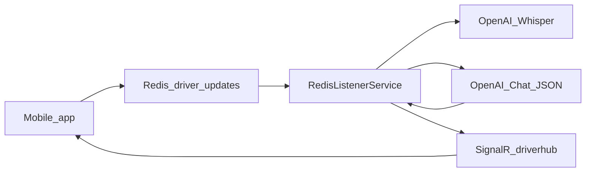

## AI (VibeDrive)

This document explains what AI features exist in this repo, how they work, and what configuration is required.

### What AI does (current implementation)

- **Audio transcription (Whisper)**
  - The .NET API transcribes uploaded audio via OpenAI Whisper.
  - Code: `microservice-net/VibeDrive.Api/Services/OpenAIService.cs` (`TranscribeAudioAsync`)

- **Command extraction (Chat Completions → JSON)**
  - After transcription, the .NET API asks OpenAI to return a JSON command describing the user’s intent.
  - Code:
    - `microservice-net/VibeDrive.Api/Services/OpenAIService.cs` (`ProcessTranscriptionAsync`, `ProcessTranscriptionWithContextAsync`)
    - `microservice-net/VibeDrive.Api/Services/RedisListenerService.cs` (dispatches actions and pushes messages to the app via SignalR)

- **Route setup parsing from text (AI)**
  - Endpoint: `POST /api/v1/driver/route/parse-setup`
  - Body: `{ "text": "..." }`
  - Code: `microservice-net/VibeDrive.Api/Controllers/DriverRouteController.cs`

### What AI does not do (yet)

- **AI does not fill the Route Setup form automatically.**
  - The current Route Setup UI is manual inputs only:
    - `mobile-app/src/screens/RouteSetupScreen.tsx`

- **AI does not currently operate on real route/loads state inside the .NET API.**
  - The route/loads context provider is a no-op stub:
    - `microservice-net/VibeDrive.Api/Services/NoOpRouteLoadsService.cs`
    - Registered in `microservice-net/VibeDrive.Api/Program.cs` as `IRouteLoadsService`

### Configuration

The .NET API reads the OpenAI key from:

- `OpenAI:ApiKey` in `microservice-net/VibeDrive.Api/appsettings.json`, or
- environment variable `OPENAI_API_KEY`

Recommended for production: set `OPENAI_API_KEY` in your runtime environment (do not hardcode keys into `appsettings.json`).

### Message flow (high-level)

### Testing checklist

- **OpenAI key set**: confirm `OPENAI_API_KEY` exists in the .NET API environment.
- **Redis listener running**: `RedisListenerService` must be active.
- **SignalR connected**: mobile must be connected to `/driverhub` and grouped by userId.
- **Route parse endpoint**: call `POST /api/v1/driver/route/parse-setup` with sample text and confirm a non-empty response.

